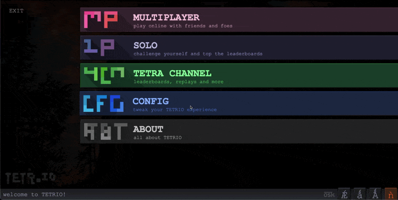

<strong>VERGE is a powerful TETR.IO analytics engine.</strong>

---
## Table of Contents
[What's VERGE?](https://github.com/MrMeCoding/TETR-VERGE?tab=readme-ov-file#whats-verge)

[Demo](https://github.com/MrMeCoding/TETR-VERGE?tab=readme-ov-file#demo)

[Features](https://github.com/MrMeCoding/TETR-VERGE?tab=readme-ov-file#features)

[Download VERGE!](https://github.com/MrMeCoding/TETR-VERGE?tab=readme-ov-file#download-verge)

[Installation](https://github.com/MrMeCoding/TETR-VERGE?tab=readme-ov-file#installation)

[FAQ](https://github.com/MrMeCoding/TETR-VERGE?tab=readme-ov-file#faq)

[More images of VERGE](https://github.com/MrMeCoding/TETR-VERGE?tab=readme-ov-file#more-images-of-verge)

[Contributing](https://github.com/MrMeCoding/TETR-VERGE?tab=readme-ov-file#contributing)

## What's VERGE?
VERGE allows you to scope out opponents and understand their playstyle, strengths and weaknesses. VERGE automatically generates a player's traits by analyzing their statistics and previous matchups. A key difference between VERGE and other TETR.IO tools is that VERGE displays these stats in-game. Instead of needing to tab to a different window and type a player's name to see their playstyle, VERGE allows you to view critical information with a single click.

## Demo

###### *VERGE does not change in game font*

## Features
- Displays:
	- A user's playstyle
	- What playstyles they win/lose against
	- Whether their stats are high/low relative to other players of similar skill
	- If they tend to win/lose after winning/losing
> [!TIP]
> Hovering over a trait displays additional information!
- Upcoming Features:
	- More customization!
	- Cloud saved Tetra League record
	- Cloud saved TETR.IO configuration
### [Download VERGE!](https://github.com/MrMeCoding/TETR-VERGE/releases/latest)

## Installation

### Windows
1. Download either VERGE for Desktop or VERGE for Desktop with TETR.IO PLUS.
2. Locate where TETR.IO Desktop's files are, for most users this is `C:\\Users\\<YOUR USERNAME>\\AppData\\Local\\Programs\\tetrio-desktop\\resources`.
2. Replace `app.asar` with the file you downloaded.
3. Enjoy!

### MacOS
1. Download either VERGE for Desktop or VERGE for Desktop with TETR.IO PLUS.
2. Open Finder, go to Applications and find TETR.IO Desktop
3. Right click TETR.IO Desktop and select "Show Package Contents".
4. Navigate into the Contents folder and then into the Resources folder.
5. Replace `app.asar` with the file you downloaded.
6. Enjoy!

### Browser
> [!IMPORTANT]
> VERGE currently only supports Chromium-based browsers.

1. Open VERGE for Browser and download `preload.js` and `manifest.json`.
2. Create a folder, the name doesn't matter.
3. Move `preload.js` and `manifest.json` into that folder.
4. Open your browser's extension page, for Chrome it's `chrome://extensions`. Enable developer mode if it is not already enabled.
5. Click Load unpacked.
6. Select the folder you created.
7. Enjoy!

## FAQ
> [!CAUTION]
> **Do not report VERGE bugs in the TETR.IO discord or Github!**

	<b>Most platforms.</b> VERGE currently supports Desktop and Chromium-based browsers.
	

		<h3>What platforms does VERGE work on?</h3>
	

	

		<h3>Does VERGE work with TETR.IO PLUS?</h3>
	

	
<b>Yes!</b> Go <a href="https://github.com/MrMeCoding/TETR-VERGE/releases/latest">here</a> to find out more!

	

		<h3>Will VERGE slow my computer down?</h3>
	

	
<b>No.</b> Tests have been run on multiple different computers, each with varying computational power. No frame rate drops or increased input latency were found when VERGE was used.

	

		<h3>Will I get banned for using VERGE?</h3>
	

	
<b>No.</b> Although VERGE provides valuable analytical data, the data it analyzes is publicly accessible and does not provide an unfair advantage. <b>However</b>, keep in mind that this is a third-party modification. Although we try to remove as many bugs as possible, it is possible that there are a few that we do not find. If you find a bug, remove VERGE and try to replicate it before reporting it. Complaining about VERGE in the TETR.IO discord will likely result in a ban.

	

		<h3>I found a bug with VERGE! What should I do?</h3>
	

	
Make sure VERGE is causing the bug, then file an issue report <a href="report_link_here">here</a>. <b>Do not</b> report VERGE bugs in the TETR.IO discord or Github!

	

		<h3>VERGE takes a long time to load.</h3>
	

	
Unfortunately, VERGE relies on TETR.IO's API, which can sometimes get overloaded. Make sure not to close the profile window. VERGE may take anywhere from 2-5 seconds to load.

	

		<h3>I want to make my own version of VERGE! Am I allowed to do that?</h3>
	

	
<b>Yes!</b> VERGE is open source, licensed under Creative Commons BY-NC-SA 4.0! Learn more <a href="https://creativecommons.org/licenses/by-nc-sa/4.0/">here</a>!

	

		<h3>Does VERGE hack my computer?</h3>
	

	
<b>No.</b>

	

		<h3>Will VERGE give me free wins?</h3>
	

	
<b>No,</b> but we'll try our best to help you win!

## More images of VERGE

---

## Contributing

VERGE would love to get contributions from the you!

If you've found an issue with VERGE, open an issue request and explain what the issue is and how to replicate it!

To contribute, please fork the repository, make your changes, and open a pull request.
Make sure to include a concise description of your changes in the PR.
Due to the way VERGE updates work, we won't be able to directly merge the code in, but will likely include your code in an upcoming update!

### Our Contributors ✨

